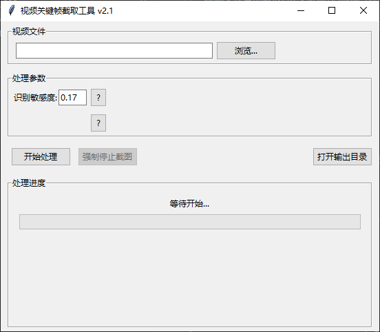

# video_frame_extractor
视频文件自动截取cut关键帧作为参考图的工具


！！**本程序无法完美识别每一个cut，只用于优化拉进度条频繁截图的繁琐工作**

！！**本程序无法完美识别每一个cut，只用于优化拉进度条频繁截图的繁琐工作**

！！**本程序无法完美识别每一个cut，只用于优化拉进度条频繁截图的繁琐工作**


# 主要功能

1. 输入文件
2. 调整敏感度阈值，进行识别
3. 第二第三步分别对一拍二/一拍三情况进行处理、获取中间帧
4. 按照中间帧进行ffmpeg调用单帧截图


## 注意事项
1. 请确保ffmpeg.exe在该程序旁边，或已位于系统路径
2. 第一阶段识别平均每20分钟视频需要2分钟解析


# 打包备忘

获取[`ffmpeg.exe`](https://www.gyan.dev/ffmpeg/builds/ffmpeg-git-essentials.7z)

```
pyinstaller --onefile --windowed --icon="./src/icon.ico" --add-binary "ffmpeg.exe;." video_frame_extractor.py

```

# bash版本备忘

```bash
# 识别分割点
 ffmpeg -i $input -vf "select='gt(scene,0.17)',showinfo" -f null - 2>&1     | grep "pts_time:" | awk -F'pts_time:' '{print $2}' | awk '{print $1}'     > timestamps.txt

# 阈值处理（过滤掉一拍二和一拍三的情况）
awk '
BEGIN {
    prev = 0;
    threshold = 0.15;  # 固定阈值
}
NR == 1 {
    print;  # 第一行总是保留
    prev = $1;
    next;
}
{
    if ($1 - prev >= threshold) {
        print;
        prev = $1;
    }
}
' timestamps.txt > filtered_timestamps.txt

# 获取中间帧
awk '
NR == 1 { prev = $1; next }  # 跳过第一行
{
    mid = (prev + $1) / 2;   # 计算中间值
    print mid;
    prev = $1;
}
' filtered_timestamps.txt > filtered_timestamps2.txt

# 4. 批量截图
offset=0.05  # 偏移0.05秒
mkdir 01
while read -r timestamp; do
    prev_time=$(awk "BEGIN {print $timestamp - $offset}")
    if (( $(echo "$prev_time >= 0" | awk '{print ($1 >= 0)}') )); then
        ffmpeg -ss "$prev_time" -i $input -vframes 1 -q:v 2 "./01/prev_frame_${timestamp}.png" -y
    else
        echo "跳过 timestamp=$timestamp（时间超出开头）"
    fi
done < filtered_timestamps2.txt